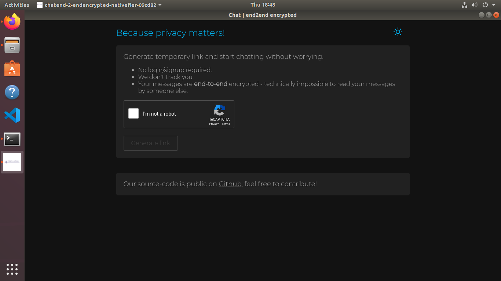

### Building native app with nativefier

You can also build a native version of the app that can run without browser (as a standalone app on your desktop).
For this purpose we are using [https://github.com/jiahaog/nativefier](nativefier) a tool that transforms the web app into a native desktop application.

#### Get started :
1. Install nativefier npm package
```
npm install -g nativefier
```
(you may need to run as `sudo` if you are configuring nativefier for all users)

2. Run conversion 
```
nativefier https://chate2ee.fun/  
#or 
nativefier https://chat-e2ee.herokuapp.com/
#or (your local react-dev instance)
nativefier http://localhost:3000
```
The nativefier will create a target native binary and will be installed on the present working directory.
You can configure the application by passing optional arguments to nativefier. Check out the below commands for help.

```
nativefier --help
#or just
nativefier
```

#### With npx :
With npx you can use nativefier for one-time-use. 
```
npx nativefier https://chate2ee.fun/ 
```

#### Build with docker 
If you don't want to install nativefier directly on your system, you pull its docker image and use it to produce the build. You just have to volume mount the target directory as `/target` into the container. Checkout the command below :
```
docker run -v ~/nativefier-apps:/target/ jiahaog/nativefier https://chate2ee.fun/ /target/
```
The above command will run a docker container which will launch nativefier in its isolated environment, we are telling nativefier to produce the binary at `/target` which is a volume monted directory.

We have provided shell script to run the above commands on Linux.

Native app running on Ubuntu:

